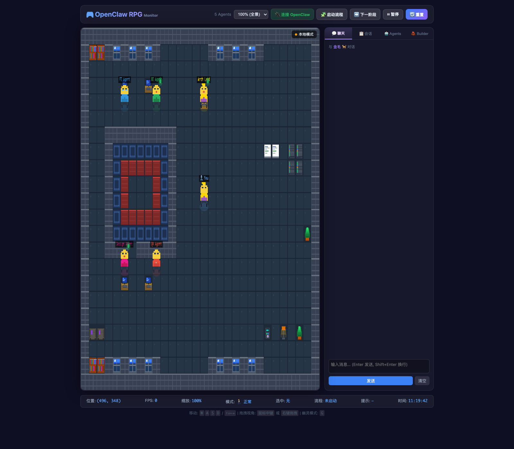
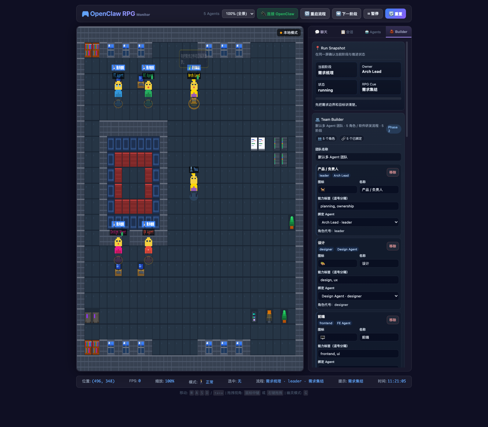

# OpenClaw Visual Management

> A browser-based visual interface for multi-agent monitoring, workflow demos, and team configuration.

<p align="center">
  
</p>

<p align="center">
  RPG-style monitoring · Team / Workflow Builder · Mock / Live modes · Zero-build setup
</p>

<p align="center">
  <a href="./README.md">中文 README</a>
</p>

---

## Table of Contents

- [Overview](#overview)
- [Highlights](#highlights)
- [Screenshots](#screenshots)
- [Quick Start](#quick-start)
- [Live Mode](#live-mode)
- [Usage](#usage)
- [Project Structure](#project-structure)
- [Development](#development)
- [Testing](#testing)
- [Known Limitations](#known-limitations)
- [Roadmap](#roadmap)
- [License](#license)

---

## Overview

OpenClaw Visual Management combines an **RPG-style map monitor**, **session sidebar**, **team/workflow builder**, and **stage transition feedback** into a lightweight frontend. It is designed for:

1. **Multi-agent visual monitoring**
   - Show agent positions, state, motion, speech bubbles, and collaboration on a pixel-art map.
2. **Workflow / team configuration demos**
   - Edit roles and workflow stages in the Builder and immediately observe the workflow progression in the UI.
3. **A visual shell for future real-backend integration**
   - The app already supports both Mock and Live modes and works well as a prototype and product demo surface.

This makes the project useful as:
- an interactive frontend prototype
- a multi-agent demo monitor
- a visual frontend shell for future backend-connected execution

---

## Highlights

- **RPG-style monitoring UI** for agents, motion, communication, and collaboration
- **Built-in Team / Workflow Builder** for roles, stages, owners, and RPG cues
- **Mock / Live dual mode** for local demos and OpenClaw Gateway integration
- **Zero-build setup** using plain HTML, CSS, and JavaScript ESM
- **Modularized frontend architecture** with clear boundaries between shell, data, workflow, runtime, entities, and scene orchestration

---

## Screenshots

### Monitor Overview

<p align="center">
  
</p>

### Builder / Workflow Workspace

<p align="center">
  
</p>

---

## Quick Start

### 1. Run a local preview server

Because the project uses browser ESM imports, **do not open the HTML file directly**. Run a local static server instead:

```bash
python3 -m http.server 4173
```

Then open:

```text
http://127.0.0.1:4173/openclaw-monitor-rpg.html
```

### 2. Default experience

The app starts in **Mock mode** by default. You can immediately:

- inspect the default agents on the map
- click `🧩 启动流程` to start a workflow demo
- click `➡️ 下一阶段` to advance the workflow
- open the `🧱 Builder` tab to edit team and workflow configuration

### 3. Common commands

```bash
# local preview
python3 -m http.server 4173

# test suite
node --test tests/*.test.mjs
```

---

## Live Mode

The top bar includes:

- `🔌 连接 OpenClaw`

Clicking it attempts to connect to an OpenClaw Gateway.

### Current implementation locations
- `src/monitor-data.js`
- `liveConfig` passed from the entrypoint

### Currently used capabilities
- `agents.list`
- `sessions.list`
- `sessions.send`
- WebSocket events (for example chat and agent status updates)

### Notes
- If you do not have a running OpenClaw Gateway locally, stay in Mock mode for development and demos.
- The project currently focuses more on frontend prototyping and visualization than on production-grade orchestration.

---

## Usage

### Map controls
- Move: `W / A / S / D` or arrow keys
- Zoom: top zoom selector
- Pan camera: middle mouse or right-click drag
- Ghost mode: press `G`

### Workflow controls
- `🧩 启动流程`: start a workflow demo run
- `➡️ 下一阶段`: move to the next stage
- `🔄 重置`: reset scene and workflow state

### Chat / Sessions
- Switch to `💬 聊天` / `📋 会话`
- View session list
- Send a message to the selected session

### Agent management
- Switch to `🤖 Agents`
- In Live mode you can:
  - create agents
  - edit agents
  - delete agents

### Builder
- Switch to `🧱 Builder`
- Edit:
  - team name
  - role metadata and bindings
  - workflow name
  - stage configuration
  - RPG cues and handoff text

---

## Project Structure

```text
.
├── openclaw-monitor-rpg.html      # shell / entrypoint
├── README.md
├── README.en.md
├── LICENSE
├── .gitignore
├── assets/
│   └── screenshots/               # README screenshot assets
├── src/
│   ├── openclaw-monitor-rpg.css   # page styles
│   ├── rpg-config.js              # runtime config, colors, workstation mapping
│   ├── agent-manager.js           # agent management UI and RPC operations
│   ├── monitor-data.js            # Mock / Live adapters and DataManager
│   ├── workflow-core.js           # workflow domain model and state engine
│   ├── workflow-panel.js          # Builder / workflow UI orchestration
│   ├── rpg-runtime.js             # AStar / GameLoop / Camera / Bubble / Comm / Minimap
│   ├── rpg-entities.js            # TileMap / Sprite / AgentEntity
│   └── rpg-scene.js               # Scene, input, update/render, bootstrap orchestration
└── tests/
    ├── openclaw-monitor-syntax.test.mjs
    └── workflow-core.test.mjs
```

---

## Development

### Stack
- plain HTML + CSS + JavaScript ESM
- no frontend framework
- no bundler
- no extra npm dependencies
- ideal for rapid demos, refactors, and concept validation

### Recommended workflow
1. Run a local static server
2. Modify the relevant module under `src/`
3. Validate visually in the browser
4. Run tests to confirm no regression

### Module boundary guidance
To keep the codebase maintainable:
- put new data-source logic in `monitor-data.js`
- put new workflow / builder logic in `workflow-panel.js` or `workflow-core.js`
- put new scene/runtime behavior in `rpg-scene.js` or `rpg-runtime.js`
- avoid growing `openclaw-monitor-rpg.html` back into a logic-heavy file

---

## Testing

### Run all tests

```bash
node --test tests/*.test.mjs
```

### Current coverage includes
- inline module script syntax remains valid
- shell references to extracted modules
- workflow-core model and state-engine behavior
- default team template and stage progression
- owner reassignment behavior
- RPG cue / stage behavior parsing

---

## Known Limitations

1. **The project is still demo/prototype-oriented**
   - It is not yet a production-grade orchestration system.
2. **Builder configuration is currently in-memory**
   - Refreshing the page does not persist edits automatically.
3. **Live mode depends on a working OpenClaw Gateway**
4. **Real backend closure is still under active development**

---

## Roadmap

The current structure is ready for further work in areas such as:

- real backend adapter closure
- Builder configuration persistence
- more fine-grained module testing
- richer RPG behavior and workflow mapping
- a more productized workflow configuration experience

---

## License

This project uses the repository `LICENSE` file.
