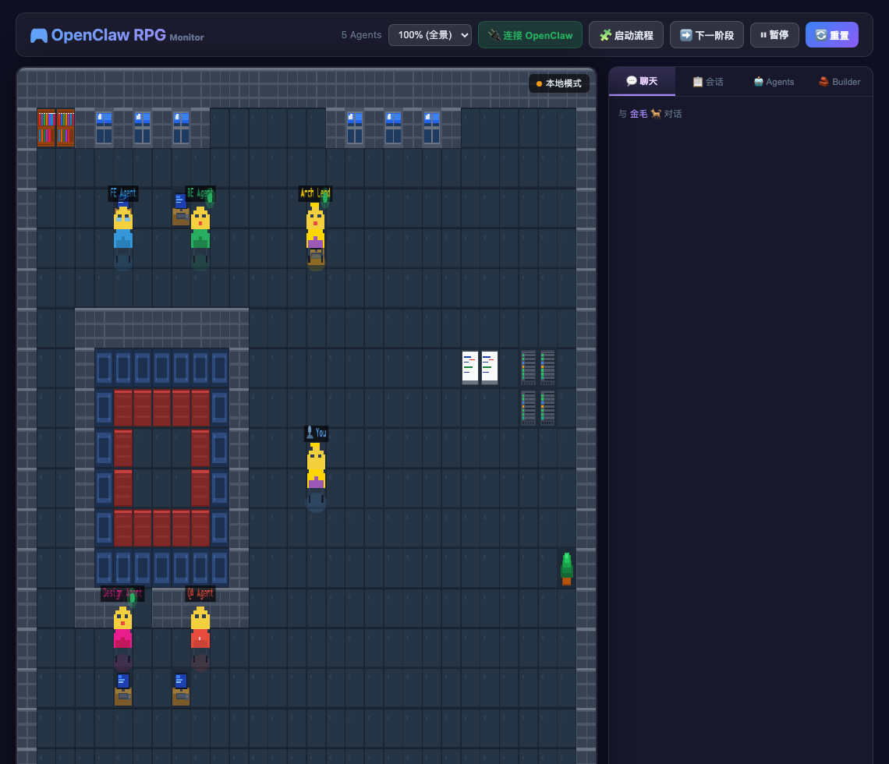
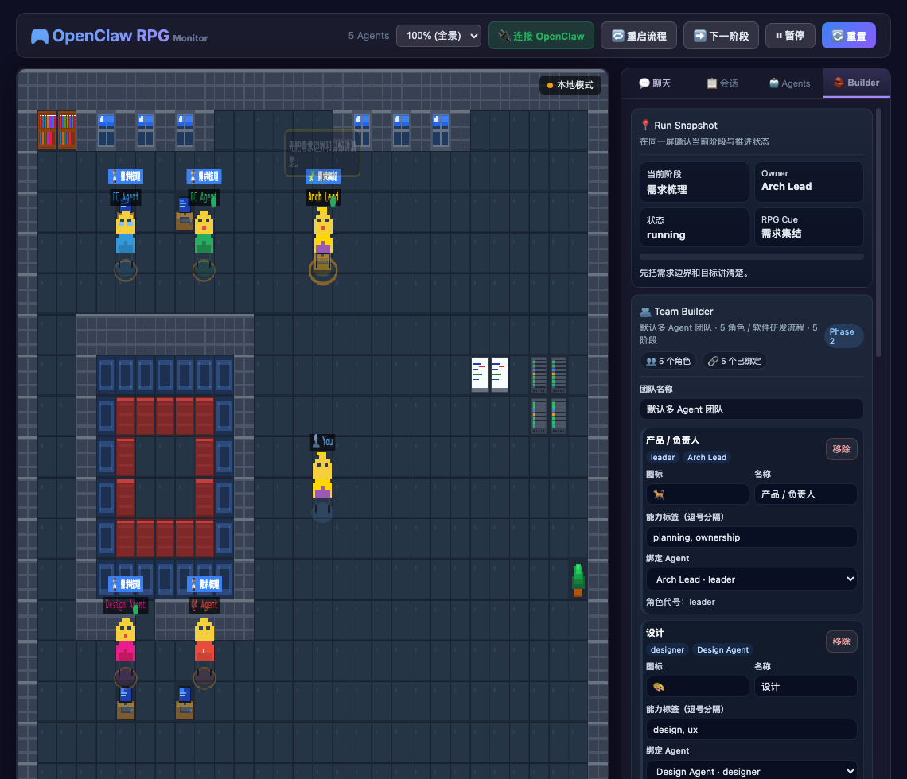

# OpenClaw Visual Management

> 一个面向多 Agent 演示、监控与工作流配置的浏览器端可视化项目。

<p align="center">
  RPG 风格地图监控 · Team / Workflow Builder · Mock / Live 双模式 · 零构建依赖
</p>

<p align="center">
  <a href="./README.en.md">English README</a>
</p>

---

## 目录

- [项目概览](#项目概览)
- [亮点](#亮点)
- [界面预览](#界面预览)
- [快速开始](#快速开始)
- [Live 模式](#live-模式)
- [使用说明](#使用说明)
- [项目结构](#项目结构)
- [开发说明](#开发说明)
- [测试](#测试)
- [已知限制](#已知限制)
- [后续方向](#后续方向)
- [许可证](#许可证)

---

## 项目概览

OpenClaw Visual Management 把 **RPG 风格地图监控**、**会话侧边栏**、**团队 / 流程 Builder** 与 **阶段推进反馈** 组合到一个轻量级前端中，用于：

1. **多 Agent 可视化监控**
   - 在一张 RPG 地图上展示 Agent 的位置、状态、运动、气泡消息和协作关系。
2. **工作流 / 团队配置演示**
   - 通过 Builder 直接编辑团队角色与流程阶段，并观察工作流在 UI 上的推进过程。
3. **后续真实后端接入的视觉载体**
   - 当前已支持 Mock / Live 双模式，适合作为原型验证和产品演示基础。

它既可以被当作：
- 一个可交互的前端原型
- 一个多 Agent 监控演示页
- 一个后续接入真实 backend 的可视化前端壳

---

## 亮点

- **RPG 风格监控界面**：用像素地图展示 Agent 状态、位置、通信与协作关系
- **内置 Team / Workflow Builder**：直接在 UI 中配置角色、阶段、owner、RPG cue
- **Mock / Live 双模式**：本地演示开箱即用，也可连接 OpenClaw Gateway
- **零构建依赖**：原生 HTML + CSS + JavaScript ESM，无需前端框架或打包器
- **已完成模块化重构**：页面壳、数据层、流程层、运行时、实体层、Scene 层职责清晰分离

---

## 界面预览

<table>
  <tr>
    <td width="50%" align="center">
      
      <br />
      <sub><b>监控总览</b></sub>
    </td>
    <td width="50%" align="center">
      
      <br />
      <sub><b>Builder / Workflow 工作区</b></sub>
    </td>
  </tr>
</table>

---

## 快速开始

### 1. 本地预览

由于项目使用浏览器 ESM 模块导入，**不要直接双击 HTML 文件** 打开。推荐使用一个本地静态服务器：

```bash
python3 -m http.server 4173
```

然后在浏览器中访问：

```text
http://127.0.0.1:4173/openclaw-monitor-rpg.html
```

### 2. 默认体验

启动后默认进入 **Mock 模式**，你可以直接：

- 查看地图中的默认 Agent
- 点击 `🧩 启动流程`
- 点击 `➡️ 下一阶段`
- 切到 `🧱 Builder` 标签页修改团队 / 流程配置

### 3. 常用开发命令

```bash
# 本地预览
python3 -m http.server 4173

# 运行测试
node --test tests/*.test.mjs
```

---

## Live 模式

页面顶部有：

- `🔌 连接 OpenClaw`

点击后会尝试连接 OpenClaw Gateway。

### 当前 Live 模式实现位置
- `src/monitor-data.js`
- 入口中传入的 `liveConfig`

### 当前会使用的能力
- `agents.list`
- `sessions.list`
- `sessions.send`
- WebSocket 事件监听（如 chat / agent 状态）

### 注意事项
- 如果本地没有可用的 OpenClaw Gateway，建议继续使用 Mock 模式进行开发和演示。
- 当前项目更偏前端原型 / 可视化演示，而不是完整的生产级调度系统。

---

## 使用说明

### 地图操作
- 移动：`W / A / S / D` 或方向键
- 缩放：顶部缩放选择器
- 视角拖拽：鼠标中键或右键拖拽
- 幽灵模式：按 `G`

### 流程操作
- `🧩 启动流程`：启动一轮 workflow demo
- `➡️ 下一阶段`：推进到下一个阶段
- `🔄 重置`：重置场景和流程状态

### Chat / Session
- 切到 `💬 聊天` / `📋 会话`
- 查看 session 列表
- 向当前选中会话发送消息

### Agent 管理
- 切到 `🤖 Agents`
- 在 Live 模式下可进行：
  - 新增 Agent
  - 编辑 Agent
  - 删除 Agent

### Builder
- 切到 `🧱 Builder`
- 可编辑：
  - 团队名称
  - 角色信息与绑定关系
  - 流程名称
  - 阶段配置
  - RPG cue 与交接语

---

## 项目结构

```text
.
├── openclaw-monitor-rpg.html      # 页面壳 / 启动入口
├── README.md
├── README.en.md
├── LICENSE
├── .gitignore
├── assets/
│   └── screenshots/               # README 截图资源
├── src/
│   ├── openclaw-monitor-rpg.css   # 页面样式
│   ├── rpg-config.js              # 运行配置、颜色、工位映射
│   ├── agent-manager.js           # Agent 管理 UI 与 RPC 操作
│   ├── monitor-data.js            # Mock / Live adapter 与 DataManager
│   ├── workflow-core.js           # Workflow 领域模型与状态引擎
│   ├── workflow-panel.js          # Builder / Workflow UI 编排
│   ├── rpg-runtime.js             # AStar / GameLoop / Camera / Bubble / Comm / Minimap
│   ├── rpg-entities.js            # TileMap / Sprite / AgentEntity
│   └── rpg-scene.js               # Scene、输入事件、update/render、bootstrap orchestration
└── tests/
    ├── openclaw-monitor-syntax.test.mjs
    └── workflow-core.test.mjs
```

---

## 开发说明

### 当前技术特点
- 原生 HTML + CSS + JavaScript ESM
- 无前端框架
- 无构建步骤
- 无额外 npm 依赖
- 适合快速演示、重构和概念验证

### 推荐开发流程
1. 使用本地静态服务器运行页面
2. 修改 `src/` 下对应模块
3. 用浏览器手动验证页面效果
4. 运行测试确认没有回归

### 模块边界建议
如果继续扩展功能，建议遵守现有模块职责边界：
- 新的数据源逻辑放入 `monitor-data.js`
- 新的工作流 / Builder 逻辑放入 `workflow-panel.js` / `workflow-core.js`
- 新的场景运行逻辑放入 `rpg-scene.js` / `rpg-runtime.js`
- 尽量不要把新逻辑重新堆回 `openclaw-monitor-rpg.html`

---

## 测试

### 运行全部测试

```bash
node --test tests/*.test.mjs
```

### 当前测试覆盖
- 主页面内联模块脚本语法有效
- 页面壳是否引用了拆分出的模块
- workflow-core 的模型和状态机行为
- 默认团队模板与阶段推进逻辑
- owner 重绑定逻辑
- RPG cue / stage behavior 解析

---

## 已知限制

1. **当前更偏演示与前端原型**
   - 不是完整的生产级调度系统
2. **Builder 配置当前主要是内存态**
   - 刷新页面后不会自动持久化
3. **Live 模式依赖可用的 OpenClaw Gateway**
4. **真实 backend 闭环仍在继续建设中**

---

## 后续方向

当前代码结构已经支持继续沿这些方向演进：

- 真实 backend adapter 闭环
- Builder 配置持久化
- 更细粒度模块测试
- 进一步增强 RPG 行为与流程映射
- 更正式的产品化工作流配置体验

---

## 许可证

本项目使用仓库根目录中的 `LICENSE`。
